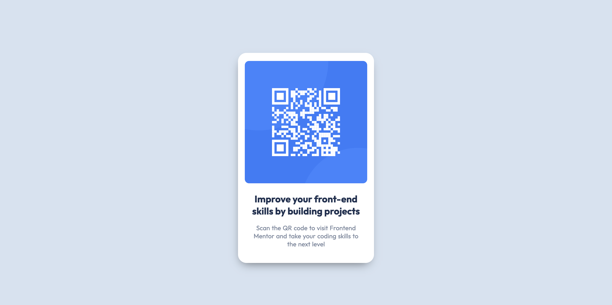

<h1 align="center">QR code component</h1>

  <h3>
    <a href="https://eliel-souza.github.io/qr-code-component-frontendmentor/">
      Site
    </a>
     |     
    <a href="https://www.frontendmentor.io/challenges/qr-code-component-iux_sIO_H">
      Challenge
    </a>
  </h3>

&nbsp;

&nbsp;

## Sobre o Projeto

Esse projeto, é um primeiro desafio perfeito se você for novo em HTML e CSS. O layout do cartão não muda, por isso é ideal se você ainda não aprendeu a criar layouts responsivos.
Seu desafio é criar o **QR code component** e deixá-lo o mais próximo possível do design.
Você pode usar qualquer ferramenta que desejar para ajudá-lo a concluir o desafio. Portanto, se você tem algo que gostaria de praticar, sinta-se à vontade para utilizar.

## Construído com

- HTML5 Semântico
- Propriedades personalizadas CSS
- BEM
- Flexbox
- Grid
- Desktop-first